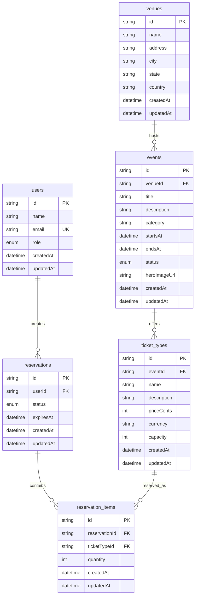

# Database Schema

This document explains the current PostgreSQL database shape as defined in `backend/prisma/schema.prisma`.

The application uses Prisma models with explicit `@@map(...)` directives, so the TypeScript/Prisma model names are PascalCase while the actual PostgreSQL table names are snake_case.

## Tables

| Prisma model      | Database table      | Purpose                                                          |
| ----------------- | ------------------- | ---------------------------------------------------------------- |
| `User`            | `users`             | Stores demo and future real users.                               |
| `Venue`           | `venues`            | Stores physical event locations.                                 |
| `Event`           | `events`            | Stores event information, schedule, status, and venue ownership. |
| `TicketType`      | `ticket_types`      | Stores ticket inventory and pricing for each event.              |
| `Reservation`     | `reservations`      | Stores temporary ticket holds for a user.                        |
| `ReservationItem` | `reservation_items` | Stores the ticket quantities inside a reservation.               |

## Relationship Overview



## Enums

### `UserRole`

Controls what a user is allowed to do.

| Value      | Meaning                                      |
| ---------- | -------------------------------------------- |
| `customer` | Can browse events and reserve/book tickets.  |
| `admin`    | Can perform admin-only actions.              |
| `staff`    | Can perform staff-level operational actions. |

### `EventStatus`

Controls whether an event should be visible or bookable.

| Value       | Meaning                                        |
| ----------- | ---------------------------------------------- |
| `draft`     | Event exists internally but is not public.     |
| `published` | Event is public and can be shown to customers. |
| `cancelled` | Event has been cancelled.                      |

### `ReservationStatus`

Controls the lifecycle of a temporary ticket hold.

| Value       | Meaning                                                 |
| ----------- | ------------------------------------------------------- |
| `pending`   | Ticket quantity is temporarily held but not booked yet. |
| `confirmed` | Placeholder for Phase 3 booking/payment confirmation.   |
| `expired`   | Reservation is no longer valid.                         |
| `cancelled` | Reservation was cancelled before completion.            |

## Table Details

### `users`

Stores all users in the system.

Key fields:

| Field                     | Notes                                                   |
| ------------------------- | ------------------------------------------------------- |
| `id`                      | Primary key generated by Prisma using `cuid()`.         |
| `name`                    | Display name.                                           |
| `email`                   | Unique identifier for demo auth and future login flows. |
| `role`                    | Uses `UserRole`; defaults to `customer`.                |
| `createdAt` / `updatedAt` | Audit timestamps.                                       |

Relationships:

| Relationship                 | Meaning                                |
| ---------------------------- | -------------------------------------- |
| `User` -> many `Reservation` | One user can create many reservations. |

### `venues`

Stores locations where events happen.

Key fields:

| Field                                 | Notes             |
| ------------------------------------- | ----------------- |
| `id`                                  | Primary key.      |
| `name`                                | Venue name.       |
| `address`, `city`, `state`, `country` | Location details. |
| `createdAt` / `updatedAt`             | Audit timestamps. |

Indexes:

| Index  | Purpose                                |
| ------ | -------------------------------------- |
| `city` | Helps filter or search venues by city. |

Relationships:

| Relationship            | Meaning                         |
| ----------------------- | ------------------------------- |
| `Venue` -> many `Event` | One venue can host many events. |

### `events`

Stores event-level information.

Key fields:

| Field                     | Notes                                              |
| ------------------------- | -------------------------------------------------- |
| `id`                      | Primary key.                                       |
| `venueId`                 | Foreign key to `venues.id`.                        |
| `title`                   | Event name.                                        |
| `description`             | Public event description.                          |
| `category`                | Event category such as music, conference, or food. |
| `startsAt` / `endsAt`     | Event schedule.                                    |
| `status`                  | Uses `EventStatus`; defaults to `draft`.           |
| `heroImageUrl`            | Optional event image.                              |
| `createdAt` / `updatedAt` | Audit timestamps.                                  |

Indexes:

| Index              | Purpose                                                 |
| ------------------ | ------------------------------------------------------- |
| `status, startsAt` | Supports listing published upcoming events efficiently. |
| `category`         | Supports category filtering.                            |
| `venueId`          | Supports venue-to-event lookups.                        |

Relationships:

| Relationship                 | Meaning                                    |
| ---------------------------- | ------------------------------------------ |
| `Event` -> one `Venue`       | Every event belongs to one venue.          |
| `Event` -> many `TicketType` | One event can offer multiple ticket types. |

### `ticket_types`

Stores ticket categories for an event.

Examples: General Admission, VIP, Balcony, Standard Pass.

Key fields:

| Field                     | Notes                                                          |
| ------------------------- | -------------------------------------------------------------- |
| `id`                      | Primary key.                                                   |
| `eventId`                 | Foreign key to `events.id`.                                    |
| `name`                    | Ticket type name.                                              |
| `description`             | Optional ticket description.                                   |
| `priceCents`              | Price stored in cents to avoid floating-point currency issues. |
| `currency`                | Defaults to `USD`.                                             |
| `capacity`                | Total inventory available for this ticket type.                |
| `createdAt` / `updatedAt` | Audit timestamps.                                              |

Indexes:

| Index     | Purpose                                     |
| --------- | ------------------------------------------- |
| `eventId` | Supports loading ticket types for an event. |

Relationships:

| Relationship                           | Meaning                                          |
| -------------------------------------- | ------------------------------------------------ |
| `TicketType` -> one `Event`            | Every ticket type belongs to one event.          |
| `TicketType` -> many `ReservationItem` | One ticket type can appear in many reservations. |

### `reservations`

Stores a temporary hold created by a user before final booking/payment.

Key fields:

| Field                     | Notes                                                       |
| ------------------------- | ----------------------------------------------------------- |
| `id`                      | Primary key.                                                |
| `userId`                  | Foreign key to `users.id`.                                  |
| `status`                  | Uses `ReservationStatus`; defaults to `pending`.            |
| `expiresAt`               | Determines when a pending hold stops reducing availability. |
| `createdAt` / `updatedAt` | Audit timestamps.                                           |

Indexes:

| Index               | Purpose                                                           |
| ------------------- | ----------------------------------------------------------------- |
| `status, expiresAt` | Supports finding active pending reservations efficiently.         |
| `userId, status`    | Supports user reservation history and active reservation lookups. |

Relationships:

| Relationship                            | Meaning                                         |
| --------------------------------------- | ----------------------------------------------- |
| `Reservation` -> one `User`             | Every reservation belongs to one user.          |
| `Reservation` -> many `ReservationItem` | One reservation can hold multiple ticket types. |

### `reservation_items`

Stores individual ticket quantities inside a reservation.

This table is the join point between reservations and ticket types.

Key fields:

| Field                     | Notes                                                                                               |
| ------------------------- | --------------------------------------------------------------------------------------------------- |
| `id`                      | Primary key.                                                                                        |
| `reservationId`           | Foreign key to `reservations.id`.                                                                   |
| `ticketTypeId`            | Foreign key to `ticket_types.id`.                                                                   |
| `quantity`                | Number of tickets held for that ticket type. Must be positive via migration-level check constraint. |
| `createdAt` / `updatedAt` | Audit timestamps.                                                                                   |

Indexes:

| Index           | Purpose                                            |
| --------------- | -------------------------------------------------- |
| `reservationId` | Supports loading items inside a reservation.       |
| `ticketTypeId`  | Supports availability calculations by ticket type. |

Relationships:

| Relationship                           | Meaning                                |
| -------------------------------------- | -------------------------------------- |
| `ReservationItem` -> one `Reservation` | Every item belongs to one reservation. |
| `ReservationItem` -> one `TicketType`  | Every item reserves one ticket type.   |

Cascade behavior:

| Rule                                                   | Meaning                                                             |
| ------------------------------------------------------ | ------------------------------------------------------------------- |
| `ReservationItem.reservation` uses `onDelete: Cascade` | Deleting a reservation deletes its reservation items automatically. |

## Availability Calculation

Phase 2 availability is calculated from ticket capacity minus active pending reservation quantities and confirmed sold quantities.

```text
available_quantity = ticket_types.capacity - active_pending_reserved_quantity - confirmed_sold_quantity
```

An active pending reservation item counts against availability only when:

```text
reservation.status = pending
reservation.expiresAt > now()
```

Expired pending reservations do not reduce availability.

Confirmed reservation items always count against availability, even after the original reservation expiry time:

```text
reservation.status = confirmed
```

## Current Data Flow

Typical event browsing flow:

```text
venues
  -> events
    -> ticket_types
      -> reservation_items
        -> reservations
```

Typical reservation flow:

```text
users
  -> reservations
    -> reservation_items
      -> ticket_types
        -> events
```

## Design Notes

- `priceCents` is used instead of decimal currency values to avoid rounding errors.
- `capacity` lives on `ticket_types`, not `events`, because each event can have multiple independent ticket inventories.
- `reservations` and `reservation_items` are separate so a single reservation can hold multiple ticket types.
- Active reservation lookup is indexed by `status` and `expiresAt` because availability checks need to quickly ignore expired holds.
- `confirmedSoldQuantity` is currently derived from confirmed reservation items. Dedicated booking tables can replace this source once the payment/booking phase is implemented.
