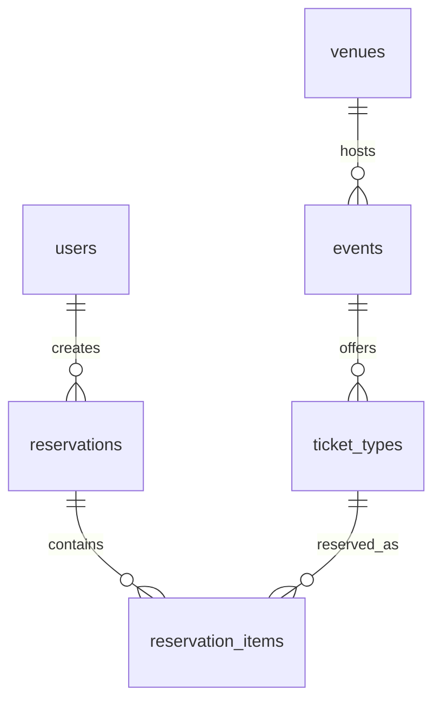

# Database Schema Guide

This document explains the current PostgreSQL schema for the Event Booking Platform and why each table exists. It is meant to give a new contributor enough context to understand the data model before reading the service code.

The current schema supports the early MVP flow:

1. Users browse published events.
2. Events happen at venues.
3. Each event has one or more ticket types with a fixed quantity capacity.
4. A customer creates a temporary reservation for ticket quantities.
5. Reservation availability is calculated from ticket capacity minus active reservations and confirmed reservations.

The schema deliberately starts with ticket-type quantities rather than exact seats. This keeps the first booking core small while still proving the most important rule: inventory correctness must be protected by PostgreSQL transactions and constraints. Future phases can extend this model with screens, seats, showtimes, payments, bookings, tickets, check-ins, and audit logs.

## Naming And Storage

Prisma model names are singular and PascalCase, while database table names are plural snake_case through `@@map`.

| Prisma model | Database table |
| --- | --- |
| `User` | `users` |
| `Venue` | `venues` |
| `Event` | `events` |
| `TicketType` | `ticket_types` |
| `Reservation` | `reservations` |
| `ReservationItem` | `reservation_items` |

Primary keys are string `cuid()` values. All models include `createdAt` and `updatedAt` timestamps so records can be inspected, ordered, and audited later.

## Relationship Overview



## Enums

### `UserRole`

Values:

- `customer`: A normal app user who browses events and reserves tickets.
- `admin`: An operator or organizer who can eventually manage events, venues, inventory, and reporting.
- `staff`: A venue or event staff user who can eventually validate tickets and check people in.

The enum exists now so authorization-sensitive flows can be shaped early, even while demo auth is still simple.

### `EventStatus`

Values:

- `draft`: Event data exists but should not be shown as bookable to customers.
- `published`: Event can be shown and reserved if it is still upcoming.
- `cancelled`: Event should no longer be bookable.

Reservation creation only accepts ticket types whose event is `published` and has not started.

### `ReservationStatus`

Values:

- `pending`: Temporary hold exists and reduces availability until it expires.
- `confirmed`: Hold has been converted into sold inventory.
- `expired`: Hold was not completed in time and should no longer reduce availability.
- `cancelled`: Hold was intentionally cancelled and should no longer reduce availability.

The current MVP uses reservations as both temporary holds and the confirmed inventory source. Later phases may add separate `Booking`, `Payment`, and `Ticket` tables while keeping reservations as the short-lived hold layer.

## Tables

### `users`

Stores people who interact with the system.

| Column | Type | Required | Default | Description |
| --- | --- | --- | --- | --- |
| `id` | `String` | Yes | `cuid()` | Stable user identifier used by reservations and future bookings. |
| `name` | `String` | Yes | None | Display name for demo accounts and customer-facing views. |
| `email` | `String` | Yes | None | Login/contact identifier. Must be unique. |
| `role` | `UserRole` | Yes | `customer` | Determines whether the user is a customer, admin, or staff member. |
| `createdAt` | `DateTime` | Yes | `now()` | Record creation time. |
| `updatedAt` | `DateTime` | Yes | `@updatedAt` | Last update time. |

Relationships:

- One user can have many reservations.

Constraints and indexes:

- Primary key on `id`.
- Unique index on `email`.

Why this table exists:

- The booking flow needs a durable owner for reservations.
- The role field lets the project grow into admin and staff workflows without redesigning the identity shape.

### `venues`

Stores physical places where events happen.

| Column | Type | Required | Default | Description |
| --- | --- | --- | --- | --- |
| `id` | `String` | Yes | `cuid()` | Stable venue identifier. |
| `name` | `String` | Yes | None | Venue display name. |
| `address` | `String` | Yes | None | Street address. |
| `city` | `String` | Yes | None | City used for discovery and filtering. |
| `state` | `String` | Yes | None | State or region. |
| `country` | `String` | Yes | None | Country. |
| `createdAt` | `DateTime` | Yes | `now()` | Record creation time. |
| `updatedAt` | `DateTime` | Yes | `@updatedAt` | Last update time. |

Relationships:

- One venue can have many events.

Constraints and indexes:

- Primary key on `id`.
- Index on `city` for location-based browsing.

Why this table exists:

- Event discovery needs venue details.
- Keeping venues separate avoids duplicating address data across events.
- Future BookMyShow-style modeling can add screens or auditoriums under a venue.

### `events`

Stores bookable event listings.

| Column | Type | Required | Default | Description |
| --- | --- | --- | --- | --- |
| `id` | `String` | Yes | `cuid()` | Stable event identifier. |
| `venueId` | `String` | Yes | None | Foreign key to `venues.id`. |
| `title` | `String` | Yes | None | Customer-facing event name. |
| `description` | `String` | Yes | None | Event details for the detail page. |
| `category` | `String` | Yes | None | Broad grouping such as music, conference, or food. |
| `startsAt` | `DateTime` | Yes | None | Event start time. Used to hide past events from reservation creation. |
| `endsAt` | `DateTime` | Yes | None | Event end time. |
| `status` | `EventStatus` | Yes | `draft` | Publication lifecycle state. |
| `heroImageUrl` | `String` | No | None | Optional image shown in customer discovery screens. |
| `createdAt` | `DateTime` | Yes | `now()` | Record creation time. |
| `updatedAt` | `DateTime` | Yes | `@updatedAt` | Last update time. |

Relationships:

- Each event belongs to one venue.
- One event can have many ticket types.

Constraints and indexes:

- Primary key on `id`.
- Foreign key from `venueId` to `venues.id`.
- Index on `(status, startsAt)` for listing upcoming published events.
- Index on `category` for category filtering.
- Index on `venueId` for venue-specific event lookups.

Why this table exists:

- It is the central catalog entity customers browse.
- The `status` and `startsAt` fields are part of the safety boundary for reservations: customers should only reserve inventory for published, future events.
- The table is intentionally event-level today; later phases can add `Showtime` so one movie or event can have multiple showings.

### `ticket_types`

Stores inventory buckets for an event.

| Column | Type | Required | Default | Description |
| --- | --- | --- | --- | --- |
| `id` | `String` | Yes | `cuid()` | Stable ticket type identifier. |
| `eventId` | `String` | Yes | None | Foreign key to `events.id`. |
| `name` | `String` | Yes | None | Customer-facing tier name, such as General Admission or Balcony. |
| `description` | `String` | No | None | Optional explanation of what this ticket tier includes. |
| `priceCents` | `Int` | Yes | None | Price in the smallest currency unit to avoid floating point money bugs. |
| `currency` | `String` | Yes | `USD` | ISO-style currency code for the price. |
| `capacity` | `Int` | Yes | None | Total quantity that can be reserved or sold for this ticket type. |
| `createdAt` | `DateTime` | Yes | `now()` | Record creation time. |
| `updatedAt` | `DateTime` | Yes | `@updatedAt` | Last update time. |

Relationships:

- Each ticket type belongs to one event.
- One ticket type can appear in many reservation items.

Constraints and indexes:

- Primary key on `id`.
- Foreign key from `eventId` to `events.id`.
- Index on `eventId` for event detail and inventory lookups.

Why this table exists:

- It is the current MVP inventory unit.
- Capacity lives here so the backend can calculate availability as:

```text
available = ticket_type.capacity - active_reserved_quantity - confirmed_quantity
```

- Reservation creation locks relevant `ticket_types` rows with PostgreSQL row locks before checking availability. That makes concurrent reservation attempts for the same ticket type wait on each other instead of overselling the same capacity.
- This table is a stepping stone toward seat-level inventory. Later, exact seats can be modeled separately while ticket types remain useful for pricing tiers or seat categories.

### `reservations`

Stores temporary or confirmed inventory holds owned by a user.

| Column | Type | Required | Default | Description |
| --- | --- | --- | --- | --- |
| `id` | `String` | Yes | `cuid()` | Stable reservation identifier returned to clients. |
| `userId` | `String` | Yes | None | Foreign key to `users.id`. |
| `status` | `ReservationStatus` | Yes | `pending` | Lifecycle state of the hold. |
| `expiresAt` | `DateTime` | Yes | None | Time when a pending reservation stops reducing availability. |
| `idempotencyKey` | `String` | No | None | Optional client-provided key for safe request retries. |
| `createdAt` | `DateTime` | Yes | `now()` | Record creation time. |
| `updatedAt` | `DateTime` | Yes | `@updatedAt` | Last update time. |

Relationships:

- Each reservation belongs to one user.
- One reservation has many reservation items.

Constraints and indexes:

- Primary key on `id`.
- Foreign key from `userId` to `users.id`.
- Unique index on `(userId, idempotencyKey)`.
- Index on `(status, expiresAt)` for expiry and availability calculations.
- Index on `(userId, status)` for user reservation lookups.

Why this table exists:

- Reservations are the core safety object for the booking flow.
- A `pending` reservation creates a short-lived hold so the customer can proceed to payment without inventory being sold out from underneath them.
- `expiresAt` lets the system ignore stale holds without immediately deleting data.
- `idempotencyKey` protects retry behavior: if a client repeats the same request after a network issue, the backend can return the original reservation instead of creating a duplicate hold.

Important behavior:

- Active pending reservations reduce availability only when `expiresAt` is in the future.
- Confirmed reservations reduce availability permanently in the current MVP.
- Expired or cancelled reservations should not reduce availability.

### `reservation_items`

Stores the ticket quantities inside a reservation.

| Column | Type | Required | Default | Description |
| --- | --- | --- | --- | --- |
| `id` | `String` | Yes | `cuid()` | Stable reservation item identifier. |
| `reservationId` | `String` | Yes | None | Foreign key to `reservations.id`. |
| `ticketTypeId` | `String` | Yes | None | Foreign key to `ticket_types.id`. |
| `quantity` | `Int` | Yes | None | Number of tickets reserved for the ticket type. Must be greater than zero. |
| `createdAt` | `DateTime` | Yes | `now()` | Record creation time. |
| `updatedAt` | `DateTime` | Yes | `@updatedAt` | Last update time. |

Relationships:

- Each reservation item belongs to one reservation.
- Each reservation item points to one ticket type.

Constraints and indexes:

- Primary key on `id`.
- Foreign key from `reservationId` to `reservations.id` with `ON DELETE CASCADE`.
- Foreign key from `ticketTypeId` to `ticket_types.id`.
- Check constraint `reservation_items_quantity_positive_check` ensures `quantity > 0`.
- Index on `reservationId` for loading reservation details.
- Index on `ticketTypeId` for availability aggregation.

Why this table exists:

- A reservation can contain multiple ticket types, such as two General Admission tickets and one Balcony ticket.
- Keeping items in a separate table avoids fixed columns like `ticketType1`, `ticketType2`, and lets availability aggregate by ticket type.
- Cascade delete from reservation to items keeps child rows from becoming orphaned if a reservation is removed during maintenance or tests.

## Reservation Availability Model

Availability is not stored as a mutable counter. It is derived from source-of-truth records:

```text
active_reserved_quantity =
  sum(reservation_items.quantity)
  where reservation.status = pending
  and reservation.expiresAt > now

confirmed_quantity =
  sum(reservation_items.quantity)
  where reservation.status = confirmed

available_quantity =
  ticket_types.capacity - active_reserved_quantity - confirmed_quantity
```

This design avoids drift between a counter column and the actual reservation records. It also makes recovery easier: if Redis or an app process fails, PostgreSQL still contains enough information to recompute inventory.

## Concurrency And Correctness

The schema supports the rule that PostgreSQL is the source of truth for inventory correctness.

During reservation creation, the backend:

1. Merges duplicate ticket type requests into one quantity per ticket type.
2. Starts a PostgreSQL transaction.
3. Selects the requested ticket type rows for published future events.
4. Locks those ticket type rows with `SELECT ... FOR UPDATE`.
5. Calculates availability from `reservation_items` and `reservations`.
6. Creates the reservation and items if enough quantity remains.

The row lock on `ticket_types` serializes competing attempts for the same inventory bucket. That prevents two concurrent requests from both seeing the same available capacity and overselling it.

Redis may assist with request guards, expiry tracking, rate limits, or caches, but Redis should not be the only thing preventing double booking. If Redis is unavailable, the PostgreSQL transaction and schema should still protect inventory correctness.

## Current Seed Data

The seed script creates:

- Three demo users: customer, admin, and staff.
- Two demo venues.
- Three demo events: two published and one draft.
- Multiple ticket types per published event so the reservation flow can exercise quantity-based availability.

This data is intentionally small and readable so local development can focus on behavior instead of setup.

## Known Gaps And Future Tables

The current schema is enough for the ticket-type reservation MVP, but it is not the full production booking model yet.

Expected future additions include:

- `screens` or `auditoriums` under venues.
- `seats` for exact seat identifiers such as `H6`.
- `showtimes` so the same event can happen at multiple times or screens.
- `reservation_seats` for seat-level holds.
- `payments` for payment attempts and provider references.
- `bookings` for final confirmed purchases.
- `tickets` for QR-ready issued tickets.
- `check_ins` for staff validation and duplicate check-in prevention.
- `audit_logs` for traceability of reservation, payment, booking, ticket, and admin actions.

The important design direction is that temporary holds, payment confirmation, final bookings, and issued tickets should become separate concepts as the platform moves beyond the MVP.
